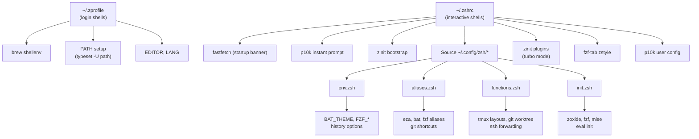

# dotfiles

Personal dotfiles managed by [chezmoi](https://www.chezmoi.io/), targeting **macOS** with **Zsh**.

Inspired by [Basecamp's Omarchy](https://github.com/basecamp/omarchy) CLI philosophy — modern, minimalist tools replacing legacy UNIX defaults — but rebuilt from scratch for Zsh on macOS.

## Quick Start

```bash
# First-time setup on a new Mac
chezmoi init --apply <your-github-username>/dotfiles

# After cloning / editing source files
chezmoi diff      # Preview changes
chezmoi apply     # Deploy to $HOME
```

## Architecture



### Directory Structure

```text
~/.local/share/chezmoi/          ← chezmoi source directory
├── .chezmoi.toml.tmpl           ← Interactive prompts (is_work_machine?)
├── .chezmoiignore.tmpl          ← OS/context-conditional file ignoring
├── .chezmoiroot                 ← Points to home/ as the source root
│
├── Brewfiles/
│   ├── Brewfile.base            ← All-machine Homebrew dependencies
│   └── Brewfile.personal        ← Personal apps (ignored on work machines)
│
├── home/                        ← chezmoi source root (.chezmoiroot = home)
│   ├── run_once_before_00-install-homebrew.sh.tmpl
│   ├── run_onchange_before_00-install-packages.sh.tmpl
│   ├── run_onchange_before_20-install-brew-packages.sh.tmpl
│   │
│   ├── dot_zprofile             ← Login shell: brew shellenv, PATH, EDITOR
│   ├── dot_zshrc.tmpl           ← Interactive shell: p10k, zinit, plugins
│   ├── dot_p10k.zsh             ← Powerlevel10k theme config
│   ├── empty_dot_zshenv         ← Empty (macOS convention)
│   ├── empty_dot_zlogin         ← Empty
│   ├── empty_dot_zlogout        ← Empty
│   │
│   └── dot_config/
│       ├── zsh/                 ← Modular Zsh config (sourced by .zshrc)
│       │   ├── env.zsh          ← Environment vars, history, FZF/BAT config
│       │   ├── aliases.zsh      ← CLI aliases (eza, bat, git, fzf, etc.)
│       │   ├── functions.zsh    ← Interactive functions (tmux, git worktree, ssh)
│       │   └── init.zsh         ← Tool init evals (zoxide, fzf, mise)
│       │
│       └── nvim/                ← LazyVim Neovim configuration
│           ├── init.lua
│           └── lua/
│               ├── config/      ← lazy.lua, options.lua, keymaps.lua, autocmds.lua
│               └── plugins/     ← Plugin specs (example.lua)
│
└── omarchy/                     ← READ-ONLY reference (Basecamp's Omarchy bash configs)
```

## Zsh Configuration File Convention

Following the [standard Zsh configuration hierarchy](https://www.freecodecamp.org/news/how-do-zsh-configuration-files-work/):

| File | When Loaded | Purpose in This Repo |
|------|------------|---------------------|
| `~/.zshenv` | All shells | Empty — not used on macOS (path_helper overrides) |
| `~/.zprofile` | Login shells | `brew shellenv`, PATH setup, EDITOR/LANG |
| `~/.zshrc` | Interactive shells | Zinit, p10k, plugins, sources `~/.config/zsh/*.zsh` |
| `~/.zlogin` | Login shells (after .zshrc) | Empty — rarely needed |
| `~/.zlogout` | Shell exit | Empty |

## Toolchain

| Category | Tool | Replaces |
|----------|------|----------|
| Shell | Zsh | bash |
| Plugin Manager | zinit (Turbo Mode) | oh-my-zsh |
| Prompt | Powerlevel10k | Starship |
| Editor | Neovim + LazyVim | vim |
| `ls` | eza | ls |
| `cat` | bat / prettybat | cat |
| `find` | fd | find |
| `grep` | ripgrep / batgrep | grep |
| `cd` | zoxide | cd |
| Fuzzy Finder | fzf + fzf-tab | — |

## Chezmoi Template Variables

| Variable | Source | Description |
|----------|--------|-------------|
| `{{ .chezmoi.os }}` | Auto-detected | `darwin` on macOS |
| `{{ .chezmoi.arch }}` | Auto-detected | `arm64` (Apple Silicon) or `amd64` |
| `{{ .is_work_machine }}` | Prompted at init | Controls Brewfile.personal inclusion |

## Key Design Decisions

- **No monolithic `.zshrc`** — modular files under `~/.config/zsh/` sourced in order
- **`typeset -U path`** — prevents PATH duplication across login/subshell chains
- **All aliases guarded** with `command -v` checks — degrades gracefully
- **LazyVim uses static chezmoi files** — no `git clone` scripts; `lazy.nvim` self-bootstraps
- **Zinit Turbo Mode** — plugins load asynchronously after prompt renders
- **`.chezmoiroot = home`** — Brewfiles live at repo root, not in target home
