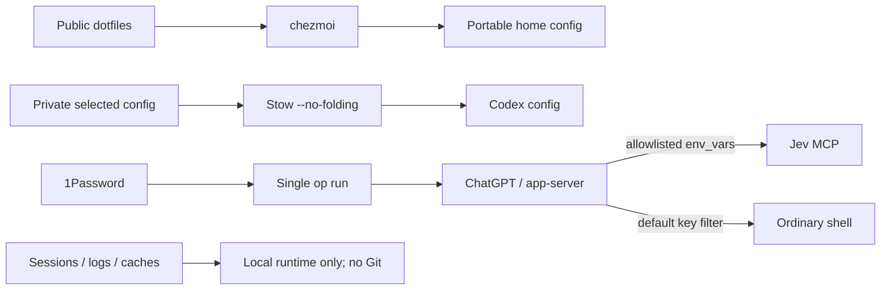

# Private workstation compatibility

The public repository is usable for portable dotfiles. To add the private
workstation layer, create your own private repository at
`$HOME/.local/share/workstation-private` or set `WORKSTATION_PRIVATE_REPO` to its
path. Keep the remote and personalized `op://` references in that repository.

This diagram is the design target. Live secret filtering, Stow projection, and
Codex Secure behavior require separate runtime acceptance checks.

Its `scripts/bootstrap.sh` must accept `--check`, `--dry-run`, and `--apply`.
It owns `Brewfiles/Brewfile.personal`, selected-file
`stow/codex/.codex/` links and its
`.config/codex-secure/credentials.env` containing
only `op://` references, and `codex-secure/build.sh` plus doctor. With
`stow --no-folding`, `~/.codex` stays a real directory; Codex sessions, logs,
and caches remain there. Private AGENTS templates generate ignored Stow
outputs before projection. Its normal apply rejects plain-file collisions;
the first migration backs up and switches selected live files as a separate,
reviewed operation. It installs private packages, runs `mise install`,
builds Codex Secure, then checks its doctor. The public entrypoint forwards the
same mode after inspecting public chezmoi. On `--apply`, it first runs the
private `--dry-run` collision check, then applies public and private layers.

Start with [the generic reference](../examples/workstation-private/README.md),
replace its placeholders in the private repository, and configure the
1Password CLI and your own vault items. Run `scripts/bootstrap.sh --check`,
review the reported public diff and private plan, then use `--apply` when ready.
Run the private Codex Secure doctor after application. Resolved secret values
belong only to 1Password and the active `op run` process tree; do not commit
or export them to a login shell.

## Migration and rollback

Before applying the public retirement, verify every former
`home/dot_codex/` file and the five personal casks have private source
replacements. Record the public diff and private Git state. Perform the
first exact-path backup and switch separately, then use normal bootstrap
`--apply` after collisions are cleared. If validation fails, remove only the new selected symlinks,
restore their backups, and restore the prior public source from Git; preserve
runtime directories. Keep backups until secure launch, doctor, and target
configuration checks pass. History audit and any rewrite are separate steps.
